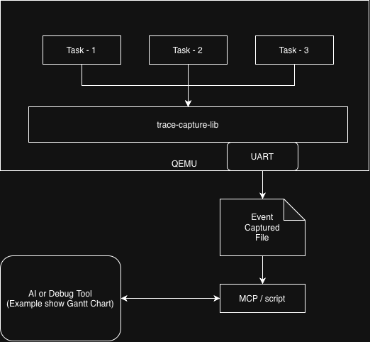
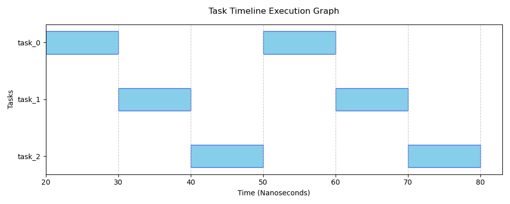

# Observability in Bare-Metal Systems: Analyzing C++20 Coroutine Execution via `trace-capture-lib`

In high-performance embedded systems, understanding the timing behavior of asynchronous workflows is critical. While traditional RTOS task switching is well-understood, the arrival of **C++20 Coroutines** introduces a new layer of complexity. Because coroutines use implicit state machines and unpredictable suspension points, visualizing their execution flow can be difficult—especially in bare-metal environments where standard debugging tools (like GDB) often lack the detail needed to capture rapid context switches.

In this post, I demonstrate how my library, `trace-capture-lib`, provides a lightweight, non-intrusive way to capture and visualize C++20 coroutine lifecycles in a bare-metal STM32 environment.

## The Challenge

In a bare-metal system, we cannot afford the overhead of heavy logging frameworks. We need a way to emit high-frequency event data with minimal CPU cycles. This helps avoid the "observer effect"—where the act of measuring the system changes its actual timing behavior.

### The Architecture

Our implementation follows a four-stage pipeline:
1.  **Instrumented Execution:** The C++20 coroutine scheduler emits lightweight event packets during every context switch.
2.  **Data Acquisition:** These events are sent via UART to a host computer.
3.  **Trace Serialization:** The raw stream is saved into a structured, machine-readable format.
4.  **Post-Process Analysis:** A Python-based analysis engine parses the trace and generates a high-resolution Gantt chart to show the task execution timeline.



> *Note: In this demonstration, we use simulated timestamps to ensure consistent output for visualization. In a real production environment, these would be mapped to high-resolution hardware timers (e.g., STM32 DWT).*

## Implementation Detail

### 1. The Target: Bare-Metal Coroutines
We implemented a simple C++20 coroutine framework running directly on an STM32. When the system starts (`ResetHandler`), it initializes three distinct coroutine tasks (`task1`, `task2`, and `task3`).

Each task follows a state-machine pattern:
*   **Execution:** Performs a computational loop.
*   **Suspension:** Yields control back to the scheduler via `co_await`.
*   **Resumption:** Waits for the scheduler to restart the coroutine context.

The scheduler itself uses a **FIFO (First-In-First-Out) algorithm**, providing a predictable way to demonstrate the task-switching sequence.

### 2. The Instrumentation: `trace-capture-lib`
To capture these transitions, we use a declarative configuration approach. We define the trace schema in YAML, which allows the library to generate highly optimized, type-safe logging code.

**Configuration Schema:**
```yaml
config:
  clock: 1000000 # 1MHz sampling frequency
traces:
  - name: coroutine
    id: 1
    params:
      - name: task_id
        type: uint8_t
```

By integrating this library into the scheduler, every context switch triggers a fast event emission. The resulting data stream is structured for high-speed parsing.

**Sample Output (relevant fields):**
```json
{
    ...
    "event" : {
        ...
         "name": "coroutine",
         "timestamp": 1250,
         "task_id": 2,
         ...
    }
    ...
}
```

### 3. Data Visualization and Analysis
Once the trace is captured, we use a custom Python script (located in `example/stm32/src/task_timing_graph.py`) to transform the raw data into a visual graph. This converts discrete events into a continuous **Gantt chart**, making it easy to identify task execution sequences and timing patterns.



## Future Outlook: AI-Augmented Analysis

While the current implementation focuses on human-readable visualization, the structured nature of the data emitted by `trace-capture-lib` opens the door to much more advanced use cases.

Because the traces are highly strucutred, they are ideally suited to be analyzed by Large Language Models (LLMs). In the future, we could see traces being fed to an AI via the **Model Context Protocol (MCP)**. This would allow an AI agent to perform automated "root cause analysis" on firmware—detecting subtle timing or logic errors that might be hard to find.

## Conclusion

As embedded systems move toward more complex asynchronous architectures, the need for specialized observability tools grows. `trace-capture-lib` provides a bridge between the "black box" of bare-metal execution and the high-level insights required for modern software engineering.

**Stay Updated:**
*   Check out the [Releases page](../releases.md) for upcoming updates and new features.
*   Bug reports and feedback are always welcome—thank you for helping improve this project!
